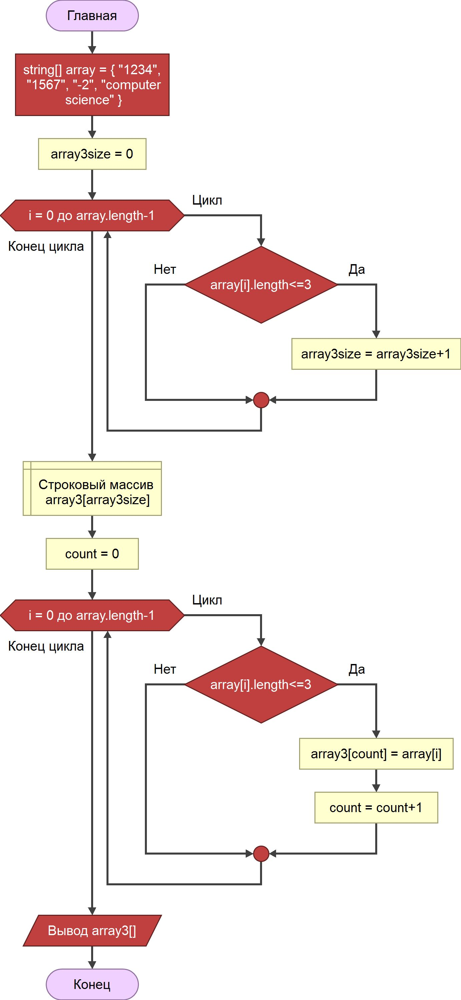
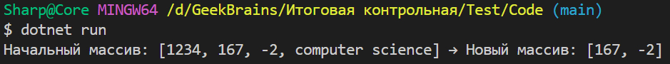

## Контрольная работа

1. Создать репозиторий на GitHub
2. Нарисовать блок-схему алгоритма (можно обойтись блок-схемой основной содержательной части, если вы выделяете её в отдельный метод)
3. Снабдить репозиторий оформленным текстовым описанием решения (файл README.md)
4. Написать программу, решающую поставленную задачу
5. Использовать контроль версий в работе над этим небольшим проектом (не должно быть так, что всё залито одним коммитом, как минимум этапы 2, 3, и 4 должны быть расположены в разных коммитах)

**Задача:** Написать программу, которая из имеющегося массива строк формирует новый массив из строк, длина которых меньше, либо равна 3 символам. Первоначальный массив можно ввести с клавиатуры, либо задать на старте выполнения алгоритма. При решении не рекомендуется пользоваться коллекциями, лучше обойтись исключительно массивами.

**Примеры:**
[“Hello”, “2”, “world”, “:-)”] → [“2”, “:-)”]
[“1234”, “1567”, “-2”, “computer science”] → [“-2”]
[“Russia”, “Denmark”, “Kazan”] → []

**Решение:**
1. Исследуем начальный массив на наличие элементов, соответствующих заданному критерию, пересчитывая их кол-во.
2. Создаём новый массив, размерностью в полученное кол-во элементов.
3. Переписываем элементы, удовлетворяющие заданному критерию, в новый массив.

**Блок-схема**



**Код программы:**

```cs
string[] array = { "1234", "167", "-2", "computer science" };
int array3size = 0, count = 0;
for (int i = 0; i < array.Length; i++)
    if (array[i].Length <= 3)
        array3size++;
string[] array3 = new string[array3size];
for (int i = 0; i < array.Length; i++)
    if (array[i].Length <= 3)
    {
        array3[count] = array[i]; count++;
    }
Console.WriteLine($"Начальный массив: [{string.Join(", ", array)}] → Новый массив: [{string.Join(", ", array3)}]");
```
**Полученный результат:**



